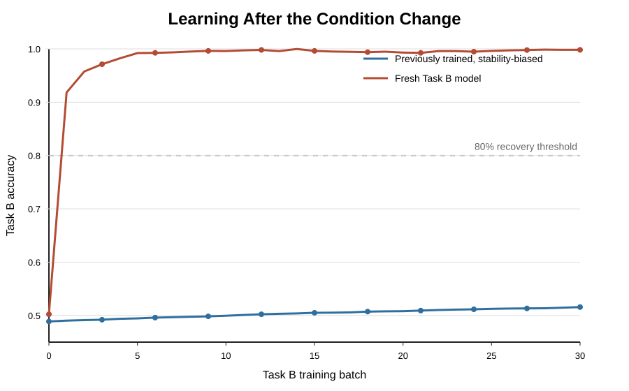

# Study

**Article:** Week 4 literature on stability, plasticity, and continued learning under changing conditions.

**Authors:** Klein et al. and related Week 4 readings.

**DOI/URL:** Course literature.

**Replication Type:** Proxy replication.

**Computational Environment:** Python.

**Primary Packages:** None beyond the Python standard library.

**Random Seed:** 735.

**Repository:** https://github.com/urmi987/anly735-lab02-urmi987

# 1. Research Claim

This laboratory investigates the claim that learning behavior can change when the environment becomes nonstationary. The narrower claim tested here is that a model can retain a previously learned capability while becoming less effective at learning what comes next. This is a stability-plasticity problem: a highly stable model may preserve old performance, but that same stability can reduce its ability to adapt after conditions change. The goal is not to reproduce every result from the Week 4 literature. Instead, this report conducts a focused proxy replication using a controlled synthetic learning experiment that makes the change in conditions explicit and measurable.

# 2. Replication Strategy

This is a proxy replication because the experiment does not use the original data, model code, or full experimental design from the Week 4 literature. Instead, it tests the same conceptual pattern in a simpler setting where the data-generating rule is fully controlled. The replication compares a previously trained, stability-biased agent with a fresh agent after a sudden change in task conditions. The evidence is evaluated using the Stability-Plasticity Diagnostic: change, retention, new learning, rate, and tradeoff. This approach is meaningful because it directly separates a performance drop from the more important question: what happens to subsequent learning after the change?

# 3. Data

The data are synthetic two-dimensional classification observations generated in Python with a fixed random seed. Each observation has two numeric predictors, `x1` and `x2`, and a binary class label. In Task A, the correct label is determined by whether `x1 + x2 > 0`. In Task B, the correct label is determined by whether `x1 - x2 > 0`. The move from Task A to Task B rotates the decision boundary and creates a controlled change in conditions. Because the data are generated by code, the experiment is reproducible without downloading or redistributing external data.

# 4. Method

The analysis uses a simple online logistic classifier implemented with gradient descent. First, the stability-biased agent is trained on Task A. Its Task A weights are then saved as an anchor. When the task changes to Task B, this agent continues learning from Task B batches, but its updates include a penalty for moving too far from the Task A solution. This represents a model that is biased toward retaining prior capability. A fresh comparison model starts with zero weights and trains only on Task B using the same incoming batches. Accuracy is measured on held-out Task A and Task B test sets after each Task B training batch. The main comparison is not only final performance, but the learning trajectory after the condition change.

# 5. Results

| Agent | Initial Task A Accuracy | Initial Task B Accuracy | Final Task A Accuracy | Final Task B Accuracy | Task A Retention Change | Task B Learning Gain | Batches to 80% Task B |
|---|---:|---:|---:|---:|---:|---:|---:|
| Previously trained, stability-biased | 0.997 | 0.489 | 0.980 | 0.516 | -0.017 | 0.027 | Not reached |
| Fresh Task B model | 0.490 | 0.502 | 0.491 | 0.998 | 0.001 | 0.496 | 1 |

The results show a clear difference between retention and new learning. The previously trained, stability-biased agent begins with high Task A accuracy of 0.997, which indicates that it retained the original capability. However, its initial Task B accuracy is only 0.489 because the decision rule changed. During Task B training, it improves only slightly, ending at 0.516. The fresh model begins without Task A knowledge, but it learns the new task quickly and reaches 0.998 Task B accuracy by the end of the experiment.

# 6. Stability-Plasticity Diagnostic

## Change

The condition change is the move from Task A to Task B. In Task A, labels depend on `x1 + x2`; in Task B, labels depend on `x1 - x2`. This is not just random noise or a temporary performance drop. The underlying rule for correct classification changes.

## Retention

The previously trained agent retains strong performance on Task A at the moment the environment changes. This matters because the evidence is not simply showing that the model failed generally. It still has prior capability.

## New Learning

After the change, the previously trained agent does improve on Task B, so it is not completely unable to learn. However, the improvement is weaker than the fresh model's improvement. This supports the narrower idea that continued learning capacity can be reduced even when old knowledge is retained.

## Rate

The fresh Task B model reaches the 80 percent Task B accuracy threshold earlier than the stability-biased agent. In this experiment, learning rate after the change is therefore an important part of the evidence. A lower immediate Task B score alone would not be enough to diagnose plasticity loss; the trajectory after the change is what matters.

## Tradeoff

The stability-biased agent preserves more of its Task A solution but pays for that stability with weaker Task B adaptation. The fresh model has no Task A capability to preserve, so it can move more freely toward the new rule. The result illustrates the tradeoff between retaining old behavior and adapting to new conditions.

# 7. Compare

| Evidence | Expected Pattern From Claim | Proxy Replication Result |
|---|---|---|
| Retention of old capability | Previously trained model should retain some prior capability | Observed: Task A performance remains high before adaptation |
| New learning after change | Previously trained model may learn the new condition less effectively | Observed: Task B learning is slower and weaker than the fresh model |
| Rate of improvement | Plasticity loss should appear in the post-change trajectory | Observed: fresh model reaches the Task B threshold earlier |
| Tradeoff | Stability can preserve old behavior while limiting adaptation | Observed: stability-biased agent retains Task A but adapts less to Task B |

The proxy replication aligns with the conceptual pattern from the Week 4 claim. The previously trained agent did not simply experience a one-time performance drop; it showed a different learning trajectory after the change. Because this experiment is synthetic and simplified, the numerical results should not be treated as directly comparable to the original literature. The meaningful comparison is the pattern: prior capability was retained, but subsequent adaptation was weaker than for a fresh learner.

# 8. Reproducibility Check

- [x] Data source documented
- [x] Code runs from beginning to end
- [x] Computational environment identified
- [x] Software/packages documented
- [x] Random seed documented
- [x] Key preprocessing steps documented
- [x] Evaluation procedure documented
- [x] Repository README provides reproduction instructions

The greatest reproducibility challenge is that this is a proxy replication rather than a direct reproduction of an original experiment. The advantage is that the synthetic setup is transparent and reproducible. The limitation is that the model, data, and stability mechanism are simplified, so the results support only a narrow version of the broader stability-plasticity claim.

# 9. Extend

A useful extension would be to repeat the experiment across many random seeds and several degrees of environmental change. The current experiment uses one fixed change from Task A to Task B. A stronger study would test whether the same pattern appears when the new task is only slightly different, moderately different, or strongly conflicting with the old task. This would show whether reduced plasticity emerges only under severe nonstationarity or whether it also appears under smaller shifts. The extension would support a more precise claim about when stability begins to interfere with continued learning.

# Replication Verdict

**Selected verdict:** Partially Reproduced.

The central pattern was partially reproduced in a controlled proxy setting: the previously trained agent retained prior Task A capability but adapted to Task B more slowly and less completely than a fresh model. The verdict is partial because the experiment tests a simplified version of the Week 4 claim rather than directly reproducing the full original study or survey evidence.

# References

::: {#refs}
:::
